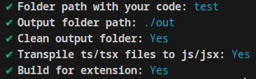
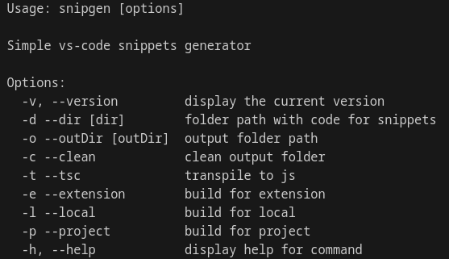

## Snipgen - cli tool for making vs-code snippets (in development)

### How to use

Name files prefix.name.extention

prefix - comibination of characters triggers template
name - name of the template
extention - file extention for language it was made

```bash
snipgen
```



```bash
snipgen -h
```


